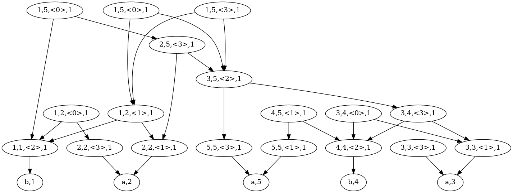
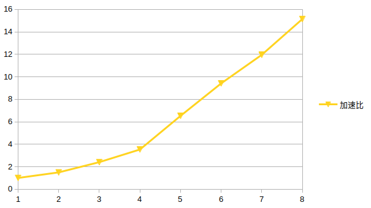

# CYK算法加速报告

SY2206220 王彦伟
yveswong@buaa.edu.cn
北京航空航天大学软件所

## 算法分析与加速实现

### 算法原理

以样例来说明算法的逻辑：

对于输入：

```
4
5
<0>::=<1><2>
<0>::=<2><3>
<1>::=<2><1>
<2>::=<3><3>
<3>::=<1><2>
3
<1>::=a
<2>::=b
<3>::=a
5
baaba
```

字母本身可以看作一个终结符（例如`a`既可以看成`<1>`也可以看成`<3>`），
同时非终结符和终结符之间存在一些映射关系（如输入第3-7行）。于是通过不断应用这些规则能够构造一棵树木，
如果树根是`<1>`，那么就是一种合法的方案。

题目的问题是：有多少种合法的方案呢？
对于本样例而言的答案是2，具体能够构建的合法语法树请见任务书。

### 算法深入理解与算法原理分析

原始算法的核心部分（同时也是性能瓶颈区域）如下，同时附带一些帮助理解代码的注释。

```cpp
for (int len = 2; len <= string_length;
     len++) // looking str starting from len 2.
{
  for (int left = 0; left <= string_length - len; left++) {
    // 在串里取一段，然后遍历这个段
    // Then how to speedup?
    SubTree subTreeBuf[2][MAX_STRING_LENGTH]; // 其本身是个二维度量
    // memset(subTreeBuf, 0, sizeof subTreeBuf);
    int curr = 0;
    int last = 1;
    int oldTreeNum = 0;
    for (int right = left + 1; right < left + len; right++) {
      // 从调试输出我们知道这里我们把这个段分成两部分（B、C），那么我们应该如何将他们合并起来，然后更新上去呢？
      // 首先我们要对区间本身有概念
      // printf("[%d, %d] = [%d, %d] + [%d, %d]\n", left, left + len, left,
      // right, right, left + len); printf("len = %d, left = %d, right =
      // %d\n", len, left, right); here we define len, left and right.
      // 这里遍历的是什么？注意我们要落到字符串之上
      // 因为B和C本身是集合，所以我们显然要看正两个集合之中的情况
      for (int i1 = 0; i1 < subTreeNumTable[left][right - 1];
           i1++) // find all related marker at this position range, for
                 // initial state(means i != j) this value seems to be 0.
      {
        // printf("--> %d\n", i1);
        SubTree subTreeChild1 = subTreeTable[left][right - 1][i1];
        for (int i2 = 0; i2 < subTreeNumTable[right][left + len - 1];
             i2++) // this algo NOT means split the seg into 2 part.
        {
          SubTree subTreeChild2 = subTreeTable[right][left + len - 1][i2];
          // 好的，现在我们已经拿出分别属于两个集合的东西了，下面进行具体的合并
          // 这里面临的问题是整个树是存在依赖的，也就是只有计算了下面的叶子节点才能计算树根的值。
          // get the transformation rules.
          // printf("get vnIndex: (%d, %d)\n", subTreeChild1.root,
          // subTreeChild2.root); 这里我们需要明确一下各个定义之间的关系！
          // 1. subTree 和 vn之间的关系？
          // ans -> vn是若干表达式
          // 2. subTree最开始的初始状态是如何建立的？
          // ans -> 刚开始是字符串 +
          // 若干特化解释，后面应该是会不断合并出结果的
          int begin = vnIndex[subTreeChild1.root][subTreeChild2.root].begin;
          int end =
              begin + vnIndex[subTreeChild1.root][subTreeChild2.root].num;
          if (begin == end) {
            continue;
          }
          swap(last, curr);
          int newTreeNum = 0;
          int k = 0; // 这里的K是另一个关键，我们应该如何理解呢？
          // 下面这个阶段是生成所有可能的根节点，因为其本身是个计数问题，所以我们要关注这个根节点是如何算出正确的数字的？
          for (int j = begin; j < end; j++) // iterate them.
          {
            SubTree subTreeParent; // yes and how can we merge two child into
                                   // it's parent?
            subTreeParent.root = production2[j].parent;
            subTreeParent.num =
                subTreeChild1.num *
                subTreeChild2
                    .num; // 这里应当是好理解的，因为每个子节点都有可能有很多节点，因此乘法原理此处适用

            // 下面是比较头疼的地方：他在两行数据之间来回折腾
            // 同时这里我们肯定注意到subTreeBuf本身是有序的
            while (
                k < oldTreeNum &&
                subTreeParent.root >
                    subTreeBuf[last][k]
                        .root) // 这里是看上次生成的节点，但是为什么存在一个有关root的大小关系呢？
              subTreeBuf[curr][newTreeNum++] = subTreeBuf[last][k++];

            if (k < oldTreeNum &&
                subTreeParent.root == subTreeBuf[last][k].root)
              subTreeParent.num +=
                  subTreeBuf[last][k++]
                      .num; // 根相同的部分我们将数字进行合并，自然不需要拷贝了！

            subTreeBuf[curr][newTreeNum++] =
                subTreeParent; // 将根放在合适的位置
          }
          // 当A、B的合并节点生成完毕后，会把剩下的部分拷贝过来，这显然也是单纯为了维护列表的有序性
          while (k < oldTreeNum) // 从这里来看是把一些东西带回来了
          {
            subTreeBuf[curr][newTreeNum++] = subTreeBuf[last][k++];
          }
          oldTreeNum = newTreeNum;
        }
      }
    }
    // 到达这里之后，相当于这个段落里面所有的B、C都合并过了，我们看看其之后会干什么？
    // 是的，就是单纯的覆盖了！
    // 其实我们可以关注一下每次都有哪些元素放到subTreeTable里面了，因为这些东西最终都会放到大表里面！
    subTreeNumTable[left][left + len - 1] = oldTreeNum;
    if (subTreeNumTable[left][left + len - 1] >
        0) // 如果产生了新状态就拼接上去
    {
      // 这里相当于将先前创建的状态都更新，而不是在后面拼接!
      // 我们需要格外关注curr会在01之间变动！
      // 不必担心，因为其本身是个滚动数组，dp那味出来了
      // 说实话，我们最关心的是[0][len - 1][0]这个状态，因为他的.num就是答案！
      // 确实这里的curr和迭代的正负有关系阿
      memcpy(subTreeTable[left][left + len - 1], subTreeBuf[curr],
             subTreeNumTable[left][left + len - 1] * sizeof(SubTree));
    }
  }
}
```

通过阅读示例代码，不难发现其虽然嵌套了一些for循环，但是直接在上面做并行性能不佳，因为存在比较严重的数据依赖。

同时，一方面为了方便我们进一步深入理解算法思想，同时尝试寻找并行的机会，我们可以根据代码的思想画出如下计算图：



从图中我们可以清晰看出，算法的本质是不断进行区间合并，也就是说首先生成`<1,1>`、`<2,2>`这样的小区间，
然后根据`<1,1>`和`<2,2>`生成更大的`<1,2>`区间，而针对`<1,3>`区间则则要考虑`<1,1>`+`<2,3>`与`<1,2>`+`<3,3>`两种合并情况。

根据上面的例子，我们就不难理清算法的数据依赖了。

### 算法原理

首先我们先定义`merge`的概念：
```cpp
void merge(unordered_map<unsigned, unsigned> &mem,
           const unordered_map<unsigned, unsigned> &va,
           const unordered_map<unsigned, unsigned> &vb) {
  for (auto ita = va.begin(); ita != va.end(); ++ita) {
    for (auto itb = vb.begin(); itb != vb.end(); ++itb) {
      auto &vroot = role[ita->first][itb->first];
      for (auto root : vroot) {
        mem[root] += ita->second * itb->second;
      }
    }
  }
  return;
}
```

其含义是将两个子树依据生成式进行合并，同时更新计数标记。

之后，我们可给出重新整理的算法核心了：
```cpp
for (int i = 1; i < len; ++i) {
  for (int j = 0; j < len - i; ++j) { // parallel
    /*
     * 0,0 0,1 0,2 0,3 0,4 <- inited.
     * 1,0 1,1 1,2 1,3
     * 2,0 2,1 2,2
     * 3,0 3,1
     * 4,0
     */
    for (int k = 1; k <= i; ++k) {
      auto &va = dp[k - 1][j];
      auto &vb = dp[i - k][j + k];
      merge(dp[i][j], va, vb);
    }
  }
}
```

此处我们将区间进行映射，例如代码当中注释的第一行的映射关系如下：
```
0,0 0,1 0,2 0,3 0,4 mapped into: 1,1 2,2 3,3 4,4 5,5
```

其他行同理，从此处我们能非常清楚的看到计算依赖关系，此处我们以计算`dp[3][0]`时的依赖为例：
```
[0,0]  0,1   0,2  [0,3] 0,4 <- inited.
[1,0]  1,1  [1,2]  1,3
[2,0] [2,1]  2,2
[3,0]  3,1
 4,0
```
实例当中所有带`[]`标记的便是数据依赖关系。因此，我们可以直接对`j`轴进行并行，
并且线程之间不存在消息通信。

## 性能测试

首先计算一下测试平台：

```
RK3588 Cortex-A55 x 4 @ 1.8GHz   Cortex-A76 x 4 @ 2.3GHz

CPU Caches:
  L1 Data 32K (x8)
  L1 Instruction 32K (x8)
  L2 Unified 128K (x8)
  L3 Unified 3072K (x1)
```

算法使用Google Benchmark对热点过程进行跑分，下面是依据题目所给定的`input2.txt`数据的不同线程计时情况：

注意：但是Google Benchmark识别到的是8x1.8G，因此有4个A76大核没有跑满，不过这正好方便我们进行后面的测试了。

| Threads       | Time(ns)           | 测试命令                                     |
|-------------- | ------------------ | ---------------------------------------------|
| 1             | 221973178603ns     | taskset -c 0 ./build/benchmark               |
| 2             | 148448341739ns     | taskset -c 0,1 ./build/benchmark             |
| 3             | 92196600647ns      | taskset -c 0,1,2 ./build/benchmark           |
| 4             | 62844402001ns      | taskset -c 0,1,2,3 ./build/benchmark         |
| 5             | 34026216728ns      | taskset -c 0,1,2,3,4 ./build/benchmark       |
| 6             | 23586149586ns      | taskset -c 0,1,2,3,4,5 ./build/benchmark     |
| 7             | 18568101648ns      | taskset -c 0,1,2,3,4,5,6 ./build/benchmark   |
| 8             | 14663536649ns      | taskset -c 0,1,2,3,4,5,6,7 ./build/benchmark |


根据benchmark的数据可画出如下示意图：



首先可明显看到整条曲线被分成两部分，猜测可能是因为大小核的架构差异。
因为线程之间没有消息同步的overhead，所以是强可扩放的。
